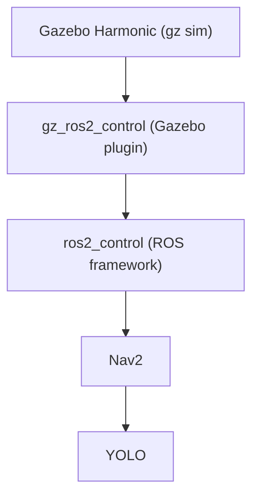

# Installation Guide

This includes guide to install relevent packages:

## Gazebo 

## Step 1 - Add the Gazebo OSRF Package Repository
```bash
sudo apt-get update
sudo apt-get install curl lsb-release gnupg
sudo curl https://packages.osrfoundation.org/gazebo.gpg \
  --output /usr/share/keyrings/pkgs-osrf-archive-keyring.gpg
  
echo "deb [arch=$(dpkg --print-architecture) signed-by=/usr/share/keyrings/pkgs-osrf-archive-keyring.gpg] \
  https://packages.osrfoundation.org/gazebo/ubuntu-stable $(lsb_release -cs) main" \
  | sudo tee /etc/apt/sources.list.d/gazebo-stable.list > /dev/null

sudo apt-get update


```

### Step 2 - Install Gazebo

```bash
sudo apt-get install gz-harmonic
```

### Step 3 - Verify Installation

Run Gazebo: 
```bash
gz sim
```

## ROS

The latest version is ROS2.

### Step 1 - Add the ROS2 Repo
```bash

sudo apt update && sudo apt install curl gnupg lsb-release
sudo curl -sSL https://raw.githubusercontent.com/ros/rosdistro/master/ros.asc -o /usr/share/keyrings/ros-archive-keyring.gpg

echo "deb [arch=$(dpkg --print-architecture) signed-by=/usr/share/keyrings/ros-archive-keyring.gpg] \
  http://packages.ros.org/ros2/ubuntu $(lsb_release -cs) main" \
  | sudo tee /etc/apt/sources.list.d/ros2.list > /dev/null

```

### Step 2 - Install ROS2


The installation of ROS is [here.](ros.md)

#### Step 3 - Create `launch.py` file

```python


```

#### Step 4 - Run the Launch File

Install colcon,

```bash
sudo apt update
sudo apt install python3-colcon-common-extensions -y

```
```
```


```
Now building Workspace

```bash

cd ~/turtlebot4_ws
colcon build
```

Now source the workspace (`launch.py` file)

```bash
source install/setup.bash


```

Now creating a ROS package inside  the workspace:
```bash
cd ~/turtlebot4_ws/src
ros2 pkg create --build-type ament_python my_turtlebot4_pkg

```

```

Now, the package turtlebot4_custom is now created:

```bash

mkdir ~/turtlebot4_ws/src/turtlebot4_custom/launch #create launch directory

mv ~/turtlebot4_ws/src/turtlebot4_custom/launch/launch.py \
   ~/turtlebot4_ws/src/turtlebot4_custom/launch/turtlebot4_sim.launch.py
# renaming for clarity

# Now building Workspace again,

cd ~/turtlebot4_ws
colcon build
source install/setup.bash

```
```
```
```
```
```

#### Flowchart



Now Learn Basics of Gazebo and ROS2 from basics.md
